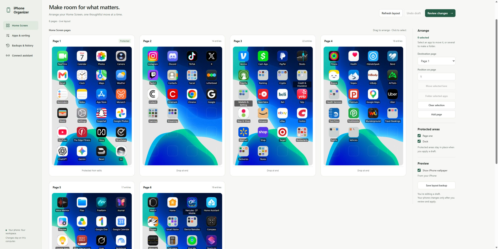

# iPhone Organizer 1.0

A portable Windows app for organizing a trusted USB-connected iPhone, with a visual interface and a shared MCP server.



## Download

Get the portable Windows x64 app from [Releases](https://github.com/BHurley98/iphone-organizer/releases/latest). The source checkout does not include the bundled runtime or device packages.

## Open it

1. Keep this entire folder together. Do not run it from inside a ZIP file.
2. Connect your iPhone, unlock it, and make sure it trusts this computer.
3. Double-click **Start Organizer.vbs**. This opens the interface in your default browser without a console window.
4. If Windows disables VBS launching, use **Start Organizer.cmd** instead. It provides startup diagnostics.

No separate Python install is needed. Windows does need Apple's device support service, normally provided by Apple Devices or iTunes. This app does not install or replace those drivers. New trust/pairing should be completed through Apple's app first.

## What it does

- Reads connected devices, app inventory, app/data storage sizes, Home Screen pages, folders, shortcuts, special icons, and dock.
- Displays real app icons read from the phone, including folder previews. Unavailable special/shortcut artwork uses a label fallback. Icons are cached in memory and can be refreshed through apps.icons.
- Excludes the com.apple namespace from Apps & sorting, exports, and uninstall plans, including previously staged plans. Apple icons remain visible and movable in Home Screen organization.
- Supports draft icon moves by dragging or by selecting an icon and choosing a destination page and position.
- Creates folders from selected apps; opens folders to move their contents; renames folders.
- Protects page one and the dock by default. These protections can be changed deliberately in the interface.
- Keeps draft undo history and browser-local draft recovery.
- Provides rapid Keep/Delete sorting with K, D, and Z shortcuts, undo, progress persistence, backup/import, and separate `keep.txt` and `delete.txt` exports.
- Imports the exported tab-separated deletion list and matches by Identifier, preserving duplicate names.
- Stages deletion separately from sorting. Actual uninstall requires review and approval.
- Stages layout changes, preserves every original Home Screen item, saves a backup before applying, and reads the phone afterward to verify the saved state.
- Saves operation reports and shows partial failures or unexpected changes rather than reporting them as success.

Draft edits are not applied until you select **Review changes**, inspect the preview, approve it, and select **Apply to iPhone**. Plans are tied to a device and its observed state. If the phone changes, refresh and create a new plan.

## Connect an assistant

Open **Connect assistant** and download the generated MCP configuration. It uses the bundled Python executable to run the standard-input/output MCP bridge. Add that server entry to your MCP-compatible assistant's settings using that application's configuration format.

The bridge starts the local engine automatically if it is not already running. The visual interface and all MCP clients share the same engine and serialized device operations. After moving this portable folder, regenerate the configuration because executable paths change.

This folder does not automatically register itself in Codex or any other assistant. Voice is supplied by the connected assistant, not by this application.

## Data and portability

- `app/`: device engine, plan handling, MCP tools, local server, and bridge source.
- `ui/`: browser interface source.
- `runtime/`: bundled Python 3.12.14 interpreter and standard library.
- `packages/`: the subset of device libraries required by these workflows.
- `data/`: created on first launch; contains plans, backups, operation history, sorting progress, and the current local server credential.
- `tests/`: isolated device simulations and protocol tests.

Move the whole folder to retain its data. Stop the organizer before moving it. You can stop it in the interface or run **Stop Organizer.cmd**. The engine can keep running after closing the browser, so connected MCP clients remain usable.

Treat `data/` as private. Do not share it in a public repository or include it in a distribution ZIP. The application binds only to loopback, uses a random startup credential, validates Host/Origin headers, and does not host a public endpoint.

Home Screen backups do **not** back up deleted app data. A restore preview requires the same phone and the same set of current Home Screen items. A layout restore cannot undo app deletion.

## Verification

Validated on a USB-connected iPhone running iOS 27.0:

- Portable device discovery, Home Screen reading, app inventory and storage sizes.
- Browser draft moving, folder creation/renaming, review, approval controls, undo, K/D/Z sorting, text export, and assistant configuration.
- Local authentication and Host/Origin rejection.
- MCP initialization, tool listing, and a live layout call through the stdio bridge.
- A live no-change layout write and read-back confirmed that the current six-page layout was preserved.

Engine simulations cover exact app deletion, partial uninstall failures, layout movement, folder creation, duplicate names, protected page/dock, special-icon preservation, stale plans, restore validation, backup retention after failure, unexpected icons, progress persistence, and protocol handling.

Actual deletion and changed-layout behavior of this release are validated with simulated devices; the underlying iPhone services were also tested with real app deletion and layout changes during development. Other phones and iOS versions may behave differently. A mismatch is reported with the original backup retained; it is not silently auto-restored.

## Develop it

The application uses Python's standard HTTP server and JSON-RPC transport handling; it does not require a browser-engine bundle or a frontend build step.

Run tests from this folder:

```text
runtime\python.exe -m unittest discover -s tests -v
```

To develop with a separate environment, install the pinned library in `requirements.txt`, then run `app/server.py`. To regenerate a portable build, use `tools/package.py` with a Python 3.12 Windows runtime directory and a directory of compatible installed device packages. The packaged launcher is Windows x64.

Application source is GPL-3.0-or-later. Third-party components retain their licenses, included in their package metadata. See `LICENSE`, `THIRD-PARTY-PACKAGES.json`, and `runtime/LICENSE.txt`.

References: [PyMobileDevice3](https://github.com/doronz88/pymobiledevice3), [MCP transports](https://modelcontextprotocol.io/specification/2025-11-25/basic/transports).


## Interface design

The light workspace follows Impeccable's guidance for task-focused product interfaces: consistent controls, restrained semantic color, clear hierarchy, and progressive disclosure. Home Screen editing uses an Arrange panel; sorting emphasizes a single app and its two choices. Product and design decisions are recorded in PRODUCT.md and DESIGN.md.

Home Screen previews use equal six-row grids, with empty positions shown only in the interface. Opening folders shows their contents below the previews. The phone's wallpaper is read locally when supported and can be toggled off; it is never packaged into the portable download.

Source development: create a Python 3.12 virtual environment, install `requirements.txt`, and run `python app/server.py`. Portable launchers require the bundled runtime supplied in the release ZIP.
